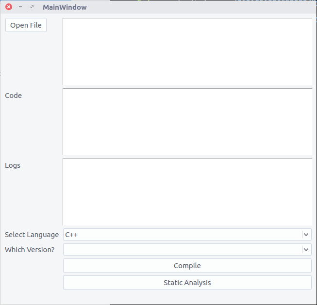
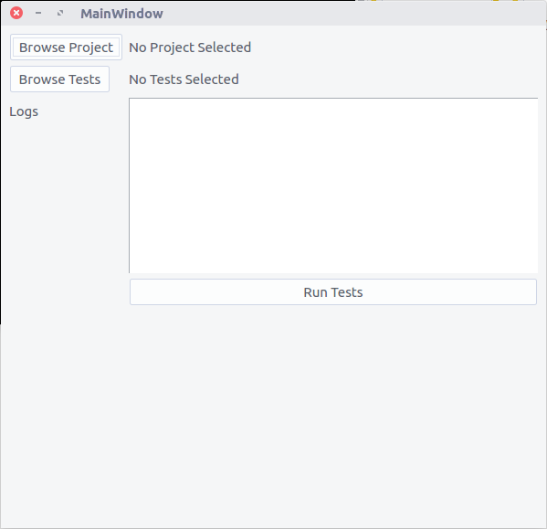

# Container Testing Platform

Our Hack, **CTP** (Container Testing Platform), aims to make the process of debugging and testing of application fast and flexible. Our platform helps to reduce the time associated in building, debugging and running projects in a specific environment.

We present a GUI which works as a black box and can be used to import projects and perform static and dynamic testing, without going through the cumbersome and exhausting task of setting up the environment manually.

## Technologies used

* Docker module to create and setup environment.
* PYQt for the GUI application.
* Python3.
* BASH

## How does it work
  ### For running the application, certain criteria should be satisfied:
  * Docker should be installed. [Install on Ubuntu](https://docs.docker.com/install/linux/docker-ce/ubuntu/) 
  * Python3 should be installed
  * **List of dependencies in python3** : docker module, PyQt4  (using pip3)
  
  ### Static Analysis
  #### Now, perform the following steps to run the application:
  1. Clone the application on your system using `git clone https://github.com/hackabit18/heavy_light_dudes`
  2. Change directory to `heavy_light_dudes`.
  3. Run the command: `sudo python3 app.py`. A window will appear. 
  
  4. Click on the `open` button and choose the folder containing your project.
  5. Select the file which you want to test.
  6. Choose the required configuration.
  7. Click on `compile` or `Static Analysis` for running the tests.
  8. The appropriate Output of your program will get displayed on `Logs` window.
  
  ### Dynamic Analysis
  Currently Dynamic Analysis is supported only for Node Projects. You can run Tests through our platform for Node projects.
  The test.js file should be present in the test folder, it should be in the format of **Mocha** test files.  
  
  1. Change directory to `DynamicTesting`.
  2. Run the command: `sudo python3 app.py`. A window will appear.
  
  3. Click on `Browse Project` button to select the project.
  4. Click on `Browse Tests` button to select the tests to be run for the projects.
  5. Click on `Run Tests` to begin the testing process.
  6. Wait for some time, the appropriate Output of your program will get displayed on `Logs` window. 
  
## Brief Description
While developing and coding an application, most of the time is spent on testing and debugging the app. with our platform, we aim to make this process of testing and debugging less frustating and much faster. We'll be providing you with the appropriate development environments which are not directly installed on your host machine, and will not break the dependencies of your previous projects that are already installed on your machine. Instead, these environments will be setup in containers! Using this methodology we're able to perform static and dynamic testing on various projects at a faster rate.

### Features
* Does not pollute or interfere the local environment of your system for running different projects.
* **Single Click Feature** to run all your Static and Dynamic tests.
* **Log window** to display the test results.
* Ease to define new environments for your projects.
* **Compilation and Static Analysis**: Currently supported for C++, JAVA and Python.
* **Dynamic Testing**: Currently supported for node projects.
* One time environment setup.

### Future Scope
The main purpose for using the container technology to build this platform was to easily deploy new testing environments.
We tend to scale this app for other dynamic testing and integration process like CI/CD. This will enable the users to quickly perform the debugging and testing procedures.

## Copyright Information
[License](https://github.com/hackabit18/heavy_light_dudes/blob/master/LICENSE)

